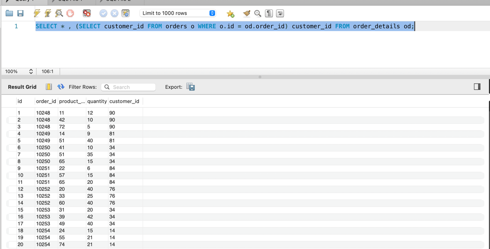
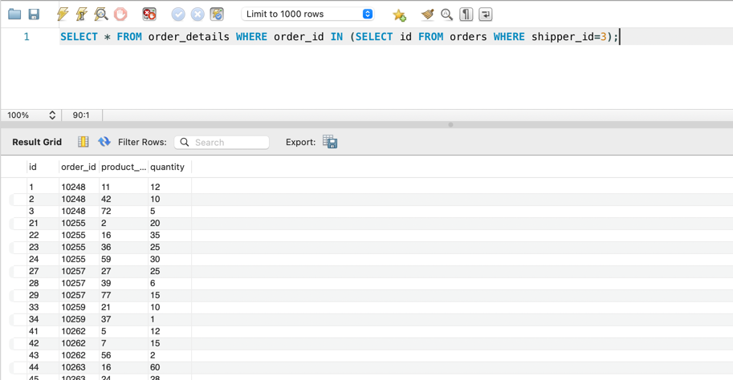
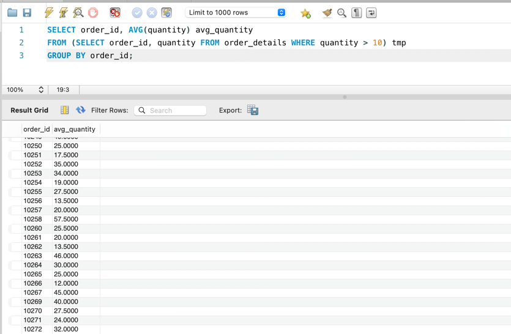
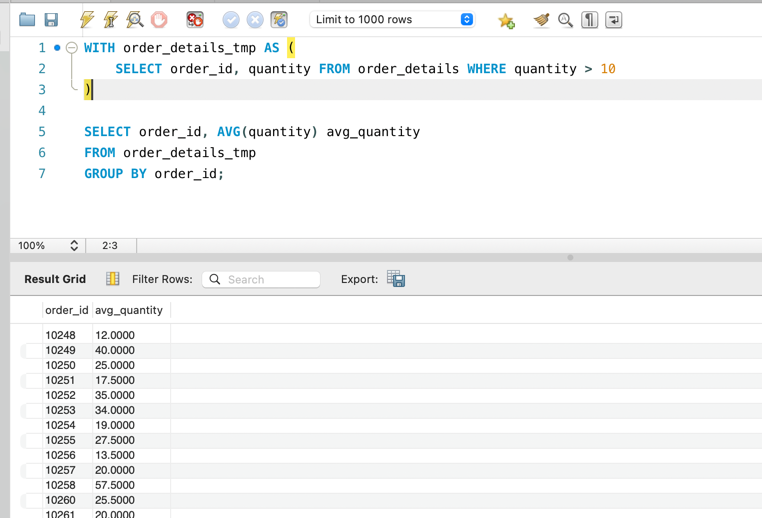
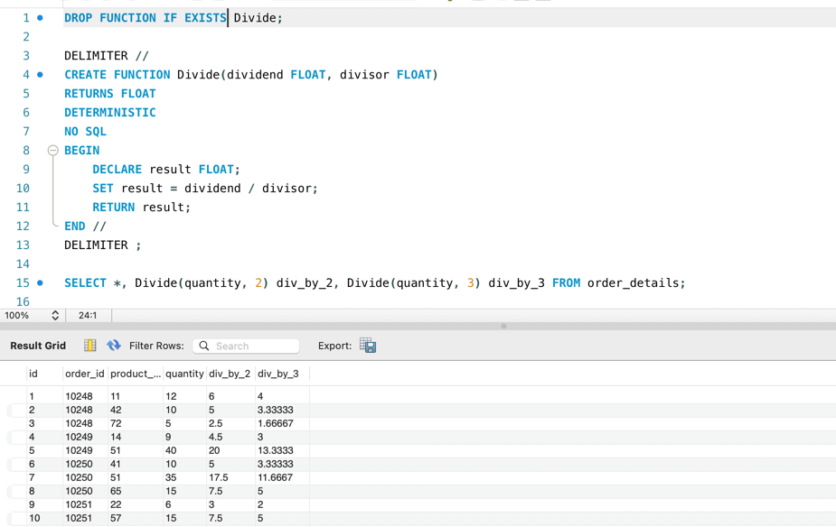

# Домашнє завдання до Теми 5. Вкладені запити. Повторне використання коду

## Опис домашнього завдання

1. Напишіть SQL запит, який буде відображати таблицю order_details та поле customer_id з таблиці orders відповідно для кожного поля запису з таблиці order_details.

Це має бути зроблено за допомогою вкладеного запиту в операторі SELECT.

``` sql
SELECT * , (SELECT customer_id FROM orders o WHERE o.id = od.order_id) customer_id FROM order_details od;
```



2. Напишіть SQL запит, який буде відображати таблицю order_details. Відфільтруйте результати так, щоб відповідний запис із таблиці orders виконував умову shipper_id=3.

Це має бути зроблено за допомогою вкладеного запиту в операторі WHERE.

``` sql
SELECT * FROM order_details WHERE order_id IN (SELECT id FROM orders WHERE shipper_id=3);
```




3. Напишіть SQL запит, вкладений в операторі FROM, який буде обирати рядки з умовою quantity>10 з таблиці order_details. Для отриманих даних знайдіть середнє значення поля quantity — групувати слід за order_id.

``` sql
SELECT order_id, AVG(quantity) avg_quantity
FROM (SELECT order_id, quantity FROM order_details WHERE quantity > 10) tmp
GROUP BY order_id;
```




4. Розв’яжіть завдання 3, використовуючи оператор WITH для створення тимчасової таблиці temp. Якщо ваша версія MySQL більш рання, ніж 8.0, створіть цей запит за аналогією до того, як це зроблено в конспекті.

``` sql
WITH order_details_tmp AS (
SELECT order_id, quantity FROM order_details WHERE quantity > 10
)

SELECT order_id, AVG(quantity) avg_quantity
FROM order_details_tmp
GROUP BY order_id;
```



5. Створіть функцію з двома параметрами, яка буде ділити перший параметр на другий. Обидва параметри та значення, що повертається, повинні мати тип FLOAT.
   Використайте конструкцію DROP FUNCTION IF EXISTS. Застосуйте функцію до атрибута quantity таблиці order_details .

``` sql
DROP FUNCTION IF EXISTS Divide;

DELIMITER //
CREATE FUNCTION Divide(dividend FLOAT, divisor FLOAT)
RETURNS FLOAT
DETERMINISTIC 
NO SQL
BEGIN
    DECLARE result FLOAT;
    SET result = dividend / divisor;
    RETURN result;
END //
DELIMITER ;

SELECT *, Divide(quantity, 2) div_by_2, Divide(quantity, 3) div_by_3 FROM order_details;
```




    
